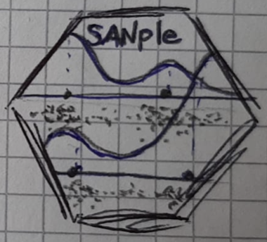

<!-- README.md is generated from README.Rmd. Please edit that file -->

```{r, include = FALSE}
knitr::opts_chunk$set(
  collapse = TRUE,
  comment = "#>",
  fig.path = "man/figures/README-",
  out.width = "100%"
)
```

# SANple v0.0.1 

<!-- badges: start -->
[](https://github.com/laura-dangelo/SANple/actions/workflows/R-CMD-check.yaml)
<!-- badges: end -->

The goal of SANple is to estimate Bayesian nested mixture models via MCMC methods. Specifically, the package implements the common atoms model (Denti et al., 2023), its finite version (D'Angelo et al., 2023), and a hybrid finite-infinite model (D'Angelo and Denti, 2023+). All models use Gaussian mixtures with a normal-inverse-gamma prior distribution on the parameters. Additional functions are provided to help analyzing the results of the fitting procedure.

## Installation

You can install the development version of SANple from [GitHub](https://github.com/) with:

``` r
# install.packages("devtools")
devtools::install_github("laura-dangelo/SANple)
```

## Example

This is a basic example which shows you how to solve a common problem:

```{r example}
library(SANple)

## basic example code
set.seed(123)
y <- c(rnorm(170),rnorm(70,5))
g <- c(rep(1,100), rep(2, 140))
plot(density(y[g==1]), xlim = c(-5,10))
lines(density(y[g==2]), col = 2)
out <- sample_fiSAN(nrep = 3000, y = y, group = g, beta = 1)
out 
```

...

# References

D’Angelo, L., Canale, A., Yu, Z., Guindani, M. (2023). Bayesian nonparametric analysis for the detection of spikes in noisy calcium imaging data. *Biometrics* 79(2), 1370--1382. \doi{10.1111/biom.13626}.

D’Angelo, L., and Denti, F. (2023+). A finite-infinite shared atoms nested model for the Bayesian analysis of large grouped data sets. *Working paper* 0--23.

<<<<<<< HEAD
Denti, F., Camerlenghi, F., Guindani, M., Mira, A., 2023. A Common Atoms Model for the Bayesian Nonparametric Analysis of Nested Data. *Journal of the American Statistical Association*. 118(541), 405--416. \doi{10.1080/01621459.2021.1933499}.
=======
Denti, F., Camerlenghi, F., Guindani, M., Mira, A., 2023. A Common Atoms Model for the Bayesian Nonparametric Analysis of Nested Data. *Journal of the American Statistical Association*. 118(541), 405--416. \doi{10.1080/01621459.2021.1933499}.
>>>>>>> cd14be43b84a642597e8a43a4205332f77670985
