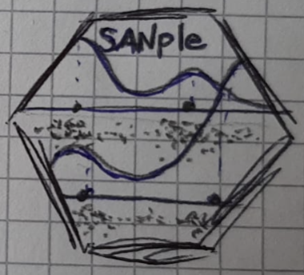
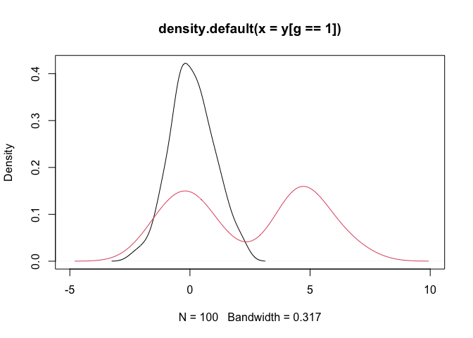
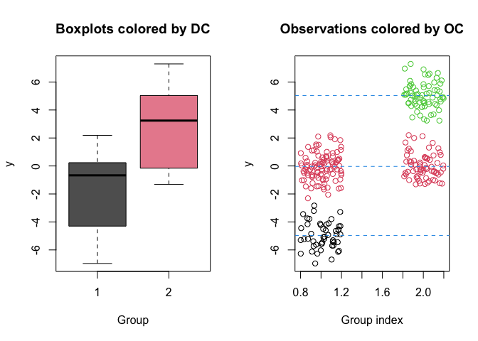

<!-- README.md is generated from README.Rmd. Please edit that file -->

# SANple v0.1.1 

<!-- badges: start -->

[](https://github.com/laura-dangelo/SANple/actions/workflows/R-CMD-check.yaml)
[](https://cran.r-project.org/package=SANple)
[](https://github.com/laura-dangelo/SANple)
[](https://www.r-pkg.org/pkg/SANple)
[](https://www.r-pkg.org/pkg/SANple)
<!-- badges: end -->

The goal of SANple is to estimate Bayesian nested mixture models via
MCMC methods. Specifically, the package implements the common atoms
model (Denti et al., 2023), its finite version (D’Angelo et al., 2023),
and a hybrid finite-infinite model (D’Angelo and Denti, 2024+). All
models use Gaussian mixtures with a normal-inverse-gamma prior
distribution on the parameters. Additional functions are provided to
help analyzing the results of the fitting procedure.

## Installation

You can install the development version of SANple from
[GitHub](https://github.com/) with:

``` r
# install.packages("devtools")
devtools::install_github("laura-dangelo/SANple")
```

## Example

This is a basic example which shows you how to solve a common problem:

``` r
library(SANple)
#> Loading required package: scales
#> Loading required package: RColorBrewer
```

``` r

## basic example code
set.seed(123)
y <- c(rnorm(50,-5,1), rnorm(170,0,1),rnorm(70,5,1))
g <- c(rep(1,150), rep(2, 140))
plot(density(y[g==1]), xlim = c(-10,10), main = "", xlab = "")
lines(density(y[g==2]), col = "cyan4")
```



``` r
out <- sample_fiSAN(nrep = 3000, burn = 1000, y = y, group = g, beta = 1)
out 
#> 
#> MCMC result of fiSAN model 
#> -----------------------------------------------
#> Model estimated on 290 total observations and 2 groups 
#> Total MCMC iterations: 3000 
#> maxL: 50 - maxK: 50 
#> Elapsed time: 1.625 secs
```

``` r
clusters <- estimate_clusters(out)
clusters
#> 
#> Summary of the estimated observational and distributional clusters 
#> 
#> ----------------------------------
#> Estimated number of observational clusters: 4 
#> Estimated number of distributional clusters: 2 
#> ----------------------------------
#> 
#> Distributional cluster 1 
#>     post_mean  post_var
#> 1 -4.96559645 0.8572352
#> 2 -0.05374608 0.9306906
#> 
#> Distributional cluster 2 
#>     post_mean  post_var
#> 3 -0.00160923 0.7737203
#> 4  5.03452815 0.8314760
```

``` r
plot(out, estimated_clusters = clusters)
```



# References

D’Angelo, L., Canale, A., Yu, Z., Guindani, M. (2023). Bayesian
nonparametric analysis for the detection of spikes in noisy calcium
imaging data. *Biometrics* 79(2), 1370–1382.

D’Angelo, L., and Denti, F. (2024+). A finite-infinite shared atoms
nested model for the Bayesian analysis of large grouped data sets.
*Working paper*, 1–34

Denti, F., Camerlenghi, F., Guindani, M., Mira, A., 2023. A Common Atoms
Model for the Bayesian Nonparametric Analysis of Nested Data. *Journal
of the American Statistical Association*. 118(541), 405–416.
