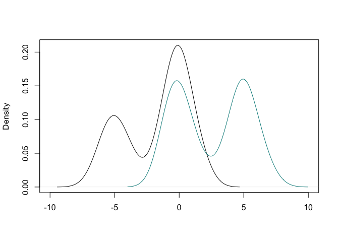
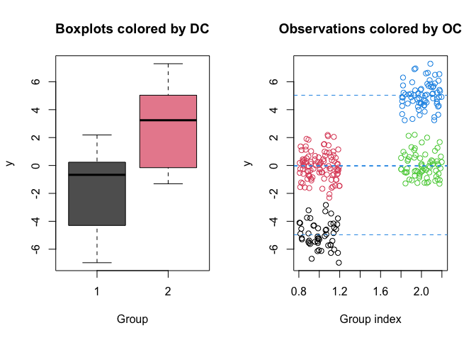

<!-- README.md is generated from README.Rmd. Please edit that file -->

# SANple v0.2.0 

<!-- badges: start
[](https://github.com/laura-dangelo/SANple/actions/workflows/R-CMD-check.yaml)
-->

[](https://cran.r-project.org/package=SANple)
[](https://github.com/laura-dangelo/SANple)
[](https://www.r-pkg.org/pkg/SANple)
[](https://www.r-pkg.org/pkg/SANple)
<!-- badges: end -->

The goal of SANple is to estimate Bayesian nested mixture models via
MCMC methods. Specifically, the package implements the common atoms
model (Denti et al., 2023), hybrid finite-infinite models (D’Angelo and
Denti, 2024). All models use Gaussian mixtures with a
normal-inverse-gamma prior distribution on the parameters. Additional
functions are provided to help analyzing the results of the fitting
procedure.

## Installation

You can install the development version of SANple from
[GitHub](https://github.com/) with:

``` r
# install.packages("devtools")
devtools::install_github("laura-dangelo/SANple")
```

## Example

This is a basic example which shows you how to solve a common problem:

``` r
library(SANple)
#> Loading required package: scales
#> Loading required package: RColorBrewer

## basic example code
set.seed(123)
y <- c(rnorm(50,-5,1), rnorm(170,0,1),rnorm(70,5,1))
g <- c(rep(1,150), rep(2, 140))
plot(density(y[g==1]), xlim = c(-10,10), main = "", xlab = "")
lines(density(y[g==2]), col = "cyan4")
```



``` r
out <- sample_fiSAN(nrep = 3000, burn = 1000, y = y, group = g, beta = 1)
out 
#> 
#> MCMC result of fiSAN model 
#> -----------------------------------------------
#> Model estimated on 290 total observations and 2 groups 
#> Total MCMC iterations: 3000 
#> maxL: 50 - maxK: 50 
#> Elapsed time: 1.453 secs
clusters <- estimate_clusters(out)
clusters
#> 
#> Summary of the estimated observational and distributional clusters 
#> 
#> ----------------------------------
#> Estimated number of observational clusters: 4 
#> Estimated number of distributional clusters: 2 
#> ----------------------------------
#> 
#> Distributional cluster 1 
#>     post_mean  post_var
#> 1 -4.96559645 0.8572352
#> 2 -0.05374608 0.9306906
#> 
#> Distributional cluster 2 
#>     post_mean  post_var
#> 3 -0.00160923 0.7737203
#> 4  5.03452815 0.8314760
plot(out, estimated_clusters = clusters)
```



# References

D’Angelo, L., and Denti, F. (2024). A Finite-Infinite Shared Atoms
Nested Model for the Bayesian Analysis of Large Grouped Data Sets.
*Bayesian Analysis*

Denti, F., Camerlenghi, F., Guindani, M., Mira, A., 2023. A Common Atoms
Model for the Bayesian Nonparametric Analysis of Nested Data. *Journal
of the American Statistical Association*. 118(541), 405–416.
